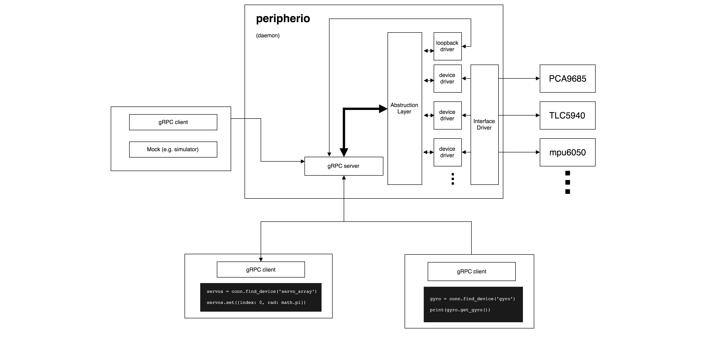

# peripherio

The peripheral interface abstraction

```python
from peripherio import connect
import time

with connect() as conn:
    device = conn.find_device('gyro', {'if.type': 'i2c'})[0]
    while True:
        print(device.get_gyro())
        time.sleep(1)
```

## Getting started

First, Launch the peripherio server:

```bash
# Start the server
cargo run --bin peripherio
```

Then, you can connect to the server. For example:

```bash
cd pyperipherio
pipenv install

# Run the client
pipenv run python examples/simple_get_gyro.py
```

## Architecture



## Progress

- [x] Category-based abstruction
- [x] Device auto detection
- [x] Driver + Config → Device
- [x] gRPC Server
- [x] Docker
- [ ] Client application (e.g. `lsperi`)
- [ ] mock driver (Simulator?)
- [ ] Add more examples
- [ ] Config injection from preference file
- [ ] Driver Package Management

## License

Licensed under either of

 * Apache License, Version 2.0
   ([LICENSE-APACHE](LICENSE-APACHE) or http://www.apache.org/licenses/LICENSE-2.0)
 * MIT license
   ([LICENSE-MIT](LICENSE-MIT) or http://opensource.org/licenses/MIT)

at your option.

## Contribution

Unless you explicitly state otherwise, any contribution intentionally submitted
for inclusion in the work by you, as defined in the Apache-2.0 license, shall be
dual licensed as above, without any additional terms or conditions.
